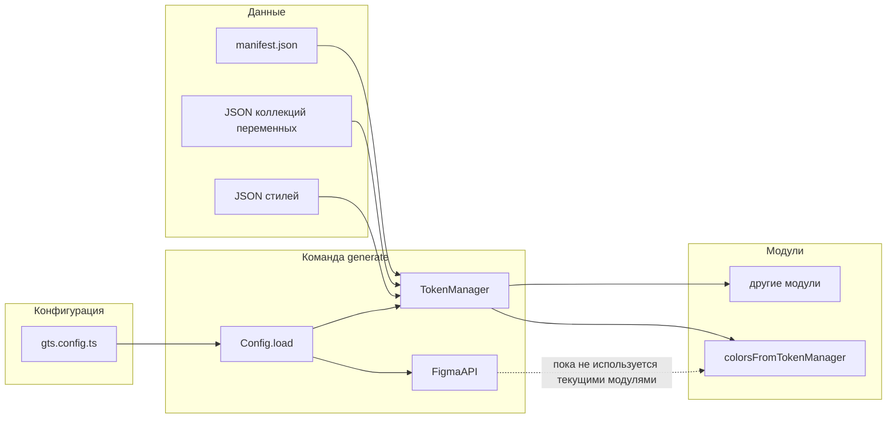
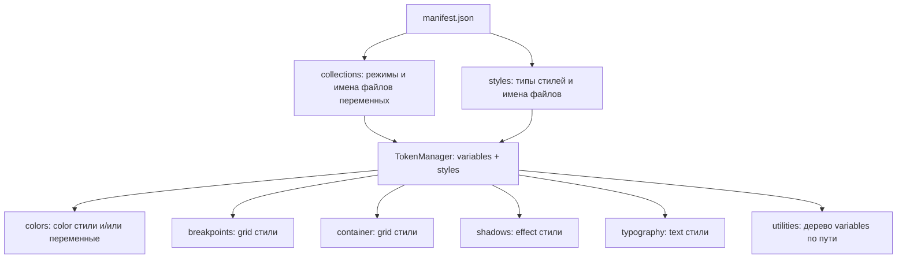

# Архитектура и поток данных

Исходные JSON и `manifest.json` обычно получают экспортом из Figma плагином **[Design Tokens Manager](https://www.figma.com/community/plugin/1263743870981744253/design-tokens-manager)** — `TokenManager` загружает именно такой комплект файлов.

## Общий поток

1. **`generate`** загружает `IGtsConfig` из `gts.config.ts`.
2. Создаётся **`FigmaAPI(figmaToken, fileId)`** и **`TokenManager(manifest)`** (если `manifest` — путь к каталогу).
3. Если `manifest` задан и путь существует, вызывается **`tokenManagerClient.load()`**, который читает `manifest.json` и подгружает файлы коллекций и стилей.
4. Для каждого модуля вызывается **`executor({ figmaApiClient, tokenManagerClient })`** (параллельно через `Promise.all`).

## Зависимость данных: от `manifest.json` к модулям

## Формат `manifest.json` (обзор)

Типы задаются в коде (`IManifest` в `src/classes/TokenManager/types/figma.ts`):

| Поле | Назначение |
|------|------------|
| `name` | Имя набора токенов (строка). |
| `collections` | Объект: имя коллекции → `{ modes: { [имяРежима]: string[] } }` — списки имён JSON-файлов переменных для каждого режима. Файлы читаются относительно каталога `manifest`. |
| `styles` | Опционально: `text`, `effect`, `color`, `grid` — массивы имён JSON-файлов со стилями соответствующего типа. |

`TokenManager` нормализует ключи (в т.ч. camelCase), парсит ссылки вида `{variable.path}` и даёт методы `getVariables()`, `getStyles()`, `resolveVariableValueString` и др.

## Контракт модуля `IModule`

- **`name`** — строковый идентификатор (например `colors/tokenManager`).
- **`executor`** — асинхронная функция с аргументом `{ figmaApiClient, tokenManagerClient }`.

Текущие реализации `*FromTokenManager` опираются только на **`tokenManagerClient`** после успешной загрузки.
